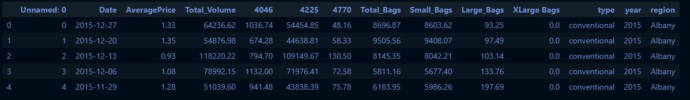
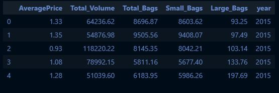
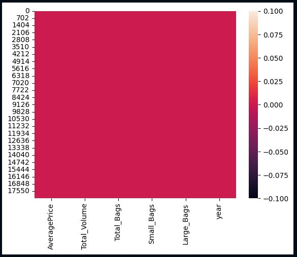
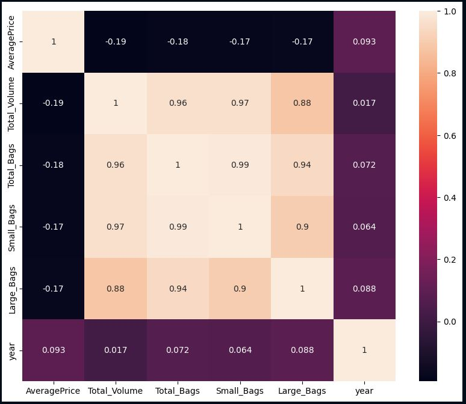
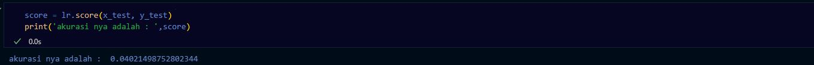
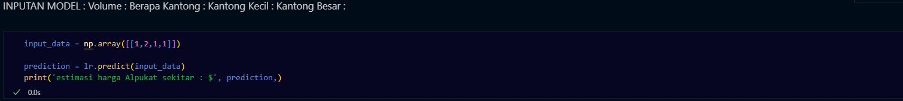
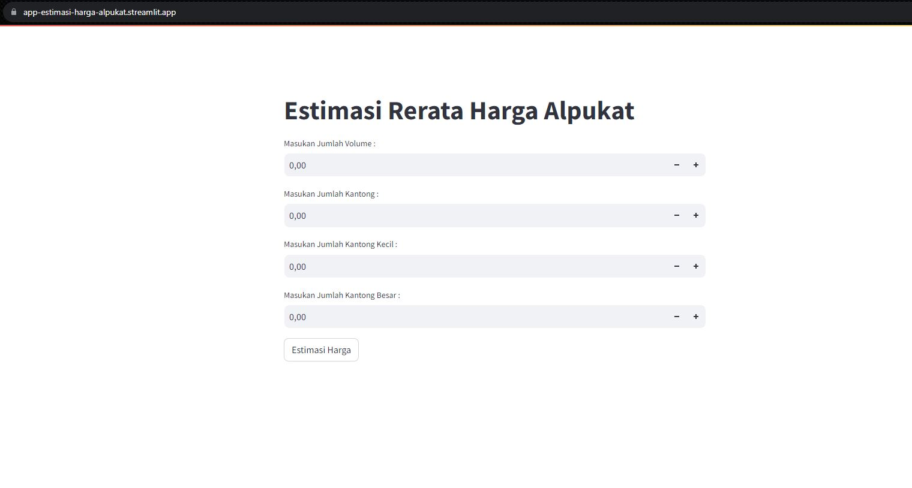

# MACHINE LEARNING PRE UTS
___
### NAMA : NUR RAHMA DIAH
### NIM : 211351107
### KELAS : MALAM A
___
## DOMAIN PROYEK
Estimasi rerata harga alpukat ini bisa dipakai untuk patokan bagi semua orang yang ingin mengetahui/menghitung rerata harga alpukat.
___
## PEMAHAMAN BISNIS
Agar mengetahui terlebih dahulu harga dan menghitung kebutuhan yang diperlukan.

Bagian ini mencakup:
### PROBLEM STATEMENT
Ketidaktahuan seseorang dalam harga alpukat untuk memulai bisnis jual beli alpukat ataupun untuk membeli dalam jumlah banyak.
### GOALS
Mempermudah sekaligus memberi informasi tentang rerata harga alpukat secara cepat.
### SOLUSI STATEMENT
- Membuat aplikasi berbasis website yang mudah digunakan dan diakses bagi semua orang.
- Metode yang dipakai menggunakan metode REGRESI LINEAR.
___
## DATA UNDERSTANDING
Datasets yang saya gunakan berasal dari [Kaggle](https://www.kaggle.com/) datasets ini saya gunakan untuk membuat estimasi rerata harga alpukat pada setiap tahunnya.
Berikut link datasets yang saya gunakan [disini](https://www.kaggle.com/datasets/neuromusic/avocado-prices)
## VARIABEL YANG DIGUNAKAN
- AveragePrices = harga rata-rata satu alpukat
- Total_Volume = Volume alpukat yang akan dibeli
- Total_Bags = Total kantong alpukat yang akan dibeli
- Small_Bags = Kantong kecil 
- Large_Bags = Kantong besar
## DATA PREPARATION
Data preparation disini mencakup sebagai berikut :
### DATA COLLECTION
Untuk data collection disini, saya menggunakan datasets [Avocado Prices](https://www.kaggle.com/datasets/neuromusic/avocado-prices).
### DATA DISCOVERY AND PROFILLING
- Hal yang pertama dilakukan yaitu membuat file ipynb
- Import library yang dibutuhkan
``` python
import pandas as pd
import numpy as np
import matplotlib.pypot as plt
import seaborn as sns
```
- Pemanggilan datasets yang akan dipakai
``` python
df = pd.read_csv("avocado.csv")
```
- Deskripsi datasets
```python
df.head()
```

- Menghapus table yang tidak dipakai
``` python
column_to_drop = 'Unnamed: 0'
df = df.drop(columns=[column_to_drop])
```
``` python
column_to_drop = 'XLarge Bags'
df = df.drop(columns=[column_to_drop])
```
``` python
column_to_drop = '4046'
df = df.drop(columns=[column_to_drop])
```
``` python
column_to_drop = '4225'
df = df.drop(columns=[column_to_drop])
```
``` python
column_to_drop = 'Date'
df = df.drop(columns=[column_to_drop])
```
``` python
column_to_drop = 'type'
df = df.drop(columns=[column_to_drop])
```
``` python
column_to_drop = 'region'
df = df.drop(columns=[column_to_drop])
```
``` python
column_to_drop = '4770'
df = df.drop(columns=[column_to_drop])
```
- Setelah dihapus  <br>

- Memeriksa apakah datasets yang saya pakai ada data null atau kosong
``` python
sns.heatmap(df.isnull())
```
 <br>
Apabila tidak ada warna selain merah berarti data yang saya pakai aman tidak ada data null.
- Melihat tabel data exploration 
``` python
plt.figure(figsize=(10,8))
sns.heatmap(df.corr(), annot=True)
```

- Memeriksa apakah ada data dummy atau data yang duplikat dan langsung saja menghapus data yang duplikat tersebut
``` python
df[df.duplicated()]
df.drop_duplicates(inplace=True)
```
- Seleksi fitur yang akan menjadi X dan Y
``` python
features = ['Total_Volume','Total_Bags','Small_Bags','Large_Bags']
x = df[features]
y = df['AveragePrice']
x.shape, y.shape
```
- Split data training dan data testing
``` python
from sklearn.model_selection import train_test_split
x_train, x_test, y_train, y_test = train_test_split(x, y, random_state=56)
y_test.shape
```
- Membuat model dengan metode Regresi Linear
``` python
from sklearn.linear_model import LinearRegression
lr = LinearRegression()
lr.fit(x_train, y_train)
y_pred = lr.predict(x_test)
```
- Membuat hasil akhir score linear
``` python
score = lr.score(x_test, y_test)
print('akurasi nya adalah : ',score)
```
  <br>
seharusnya score berada minimal di 0.70xxxx, saya lanjut saja 
- Membuat model inputan meggunakan array
``` python
input_data = np.array([[1,2,1,1]])
prediction = lr.predict(input_data)
print('estimasi harga Alpukat sekitar : $', prediction,)
```

-  Save menggunakan pickle untuk melanjutkan ke tahap pembuatan aplikasi berbasis website menggunakan bantuan streamlit
``` python
import pickle
filename ='estimasi_harga_alpukat.sav'
pickle.dump(lr,open(filename,'wb'))
```
## DEPLOYMENT
Ini adalah aplikasi rerata harga alpukat berbasis website yang sudah kita bangun menggunakan streamlit [APLIKASI](https://app-estimasi-harga-alpukat.streamlit.app/) <br>



